<div align="center">
  

  <h3 align="center">Netflix Clone (DevSecOps on OpenShift via GitOps)</h3>

  <p align="center">
    React + TypeScript + Vite app deployed on <b>OpenShift</b> using <b>ArgoCD GitOps</b>.
  </p>
</div>

## Table of contents

- [Architecture](#architecture)
- [CI/CD flow (GitOps CD)](#cicd-flow-gitops-cd)
- [DevSecOps features](#devsecops-features)
- [What is NOT in this repo](#what-is-not-in-this-repo)
- [Repository structure](#repository-structure)
- [Deploy on OpenShift (GitOps)](#deploy-on-openshift-gitops)
- [Application screenshots](#application-screenshots)
- [OpenShift / GitOps screenshots](#openshift--gitops-screenshots)
- [Local development (optional)](#local-development-optional)
- [Build & run with Docker (optional)](#build--run-with-docker-optional)

## Architecture

**GitHub → ArgoCD → OpenShift Cluster → Deployment**

- **GitHub**: source of truth (app code + OpenShift manifests under `openshift/`)
- **ArgoCD**: watches the Git repo and continuously syncs desired state to the cluster (GitOps CD)
- **OpenShift**: runs the workload and exposes it (Deployment/Service/Route), and enforces platform controls (HPA/PDB/Quota/LimitRange)

The ArgoCD `Application` definition lives in `argocd/application.yaml` and points ArgoCD to the `openshift/` folder as the desired state.

## CI/CD flow (GitOps CD)

1. **Developer pushes code to GitHub**
2. **ArgoCD detects changes**
3. **ArgoCD syncs manifests to OpenShift**
4. **OpenShift deploys / updates the application**

> Note: Build pipelines (e.g., OpenShift Pipelines / Tekton) can be used for CI (build, scan, push image). This repo focuses on the GitOps CD part; cluster-level pipeline setup is typically managed outside this repo.

## DevSecOps features

- **Kubernetes-native deployment**: `Deployment`, `Service`, `Route`
- **GitOps (ArgoCD)**: automated sync, prune, self-heal
- **Auto-scaling**: `HorizontalPodAutoscaler` (CPU-based)
- **Resilience**: `PodDisruptionBudget`
- **Resource governance**: `ResourceQuota` + `LimitRange`
- **Security context control**: `ServiceAccount` + `RoleBinding` to OpenShift SCC (see `openshift/security.yaml`)

## What is NOT in this repo

These are deployed/managed at **cluster level** and are intentionally **not** part of this repository:

- **ArgoCD Operator** (installed in OpenShift, runs in `openshift-gitops`)
- **Prometheus / Grafana** (OpenShift built-in monitoring)
- **Cluster networking / ingress routing layer** (platform-managed)

## Repository structure

```text
.
├─ argocd/
│  └─ application.yaml              # ArgoCD Application (points to openshift/)
├─ openshift/                       # Desired state applied by ArgoCD (Kustomize)
│  ├─ kustomization.yaml
│  ├─ namespace.yaml
│  ├─ security.yaml                 # SA + SCC RoleBinding
│  ├─ deployment.yaml
│  ├─ service.yaml
│  ├─ route.yaml
│  ├─ hpa.yaml
│  ├─ pdb.yaml
│  ├─ resource-quota.yaml
│  └─ limit-range.yaml
└─ src/                             # React application
```

## Deploy on OpenShift (GitOps)

### Prerequisites

- **OpenShift cluster** (CRC / dev cluster is fine)
- **OpenShift GitOps (ArgoCD)** installed (usually via Operator)
- **Access** to create an ArgoCD `Application` in `openshift-gitops`

### Steps

1. **Push this repository** to your GitHub (or any git server ArgoCD can reach).
2. **Update the repo URL** in `argocd/application.yaml`:
   - `spec.source.repoURL`: point to your fork/repo
   - `spec.source.targetRevision`: branch (e.g. `main`)
3. **Apply the ArgoCD Application** (example):

```bash
oc apply -f argocd/application.yaml
```

4. Open ArgoCD UI and confirm the app becomes **Synced** and **Healthy**.
5. The app is exposed via **OpenShift Route** (`openshift/route.yaml`).

## Application screenshots

<div align="center">
  
  <p align="center">Home Page</p>
  
  <p align="center">Mini Portal</p>
  
  <p align="center">Detail Modal</p>
  
  <p align="center">Grid Genre Page</p>
  
  <p align="center">Watch Page</p>
</div>

## OpenShift / GitOps screenshots

> These screenshots were captured from OpenShift + ArgoCD UI to document the real platform workflow.

<div align="center">
  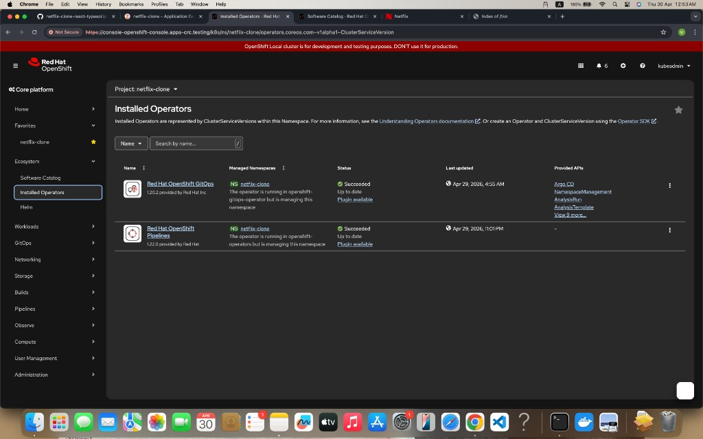
  <p align="center">Installed Operators (OpenShift GitOps + OpenShift Pipelines)</p>

  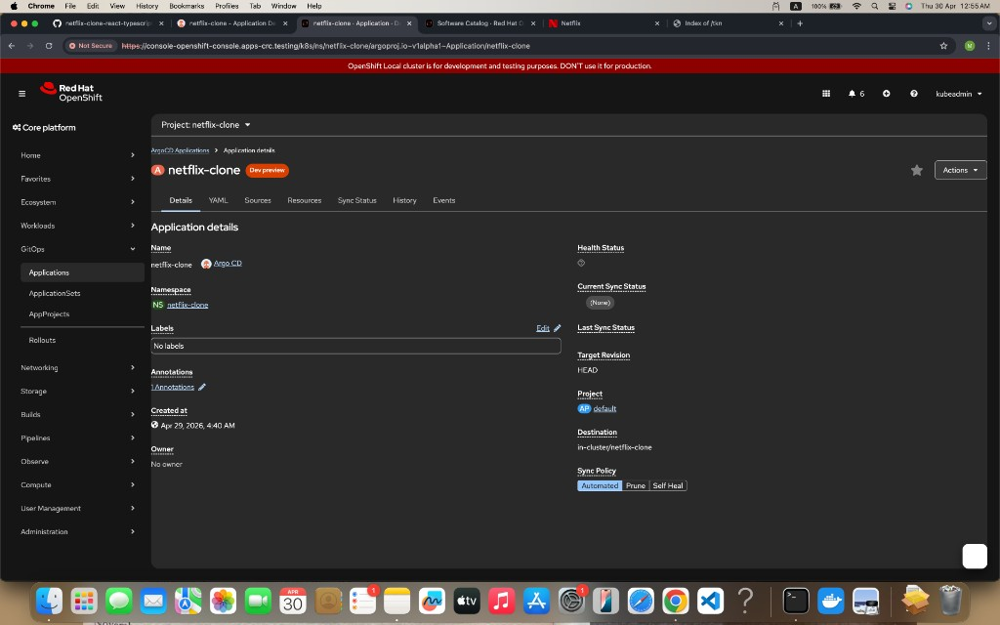
  <p align="center">ArgoCD Application details</p>

  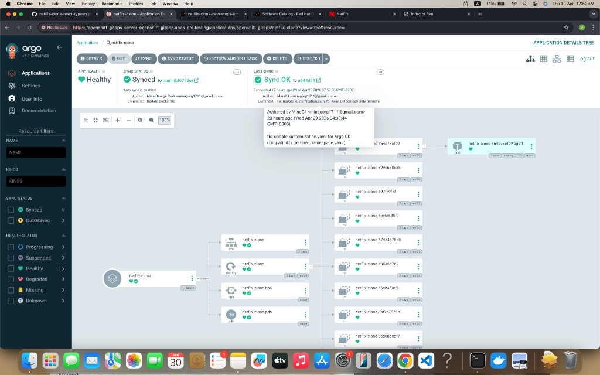
  <p align="center">ArgoCD application tree (resources in sync)</p>

  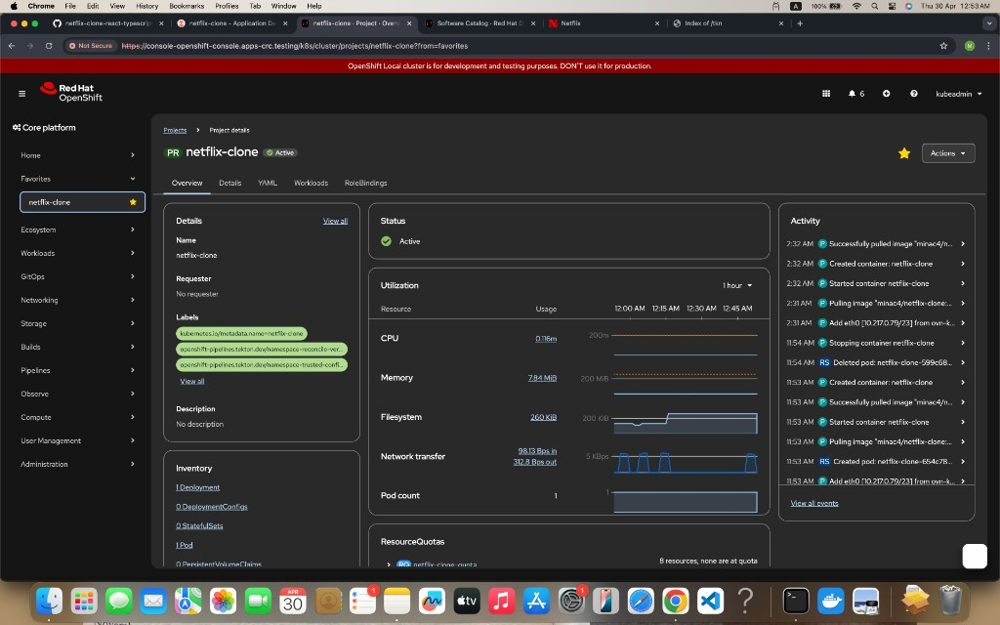
  <p align="center">OpenShift project overview</p>

  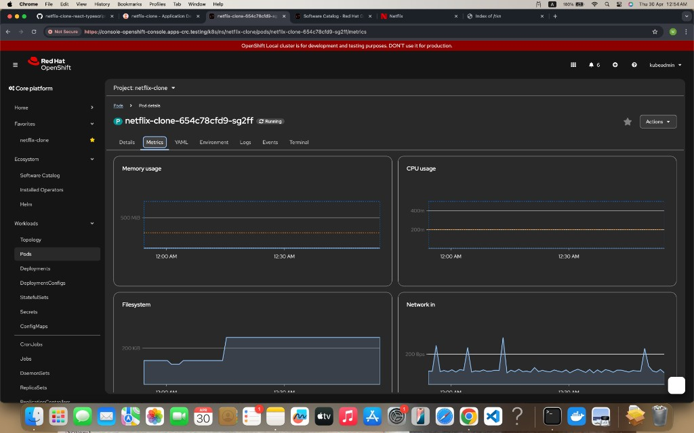
  <p align="center">Pod metrics (CPU/Memory/Network)</p>

  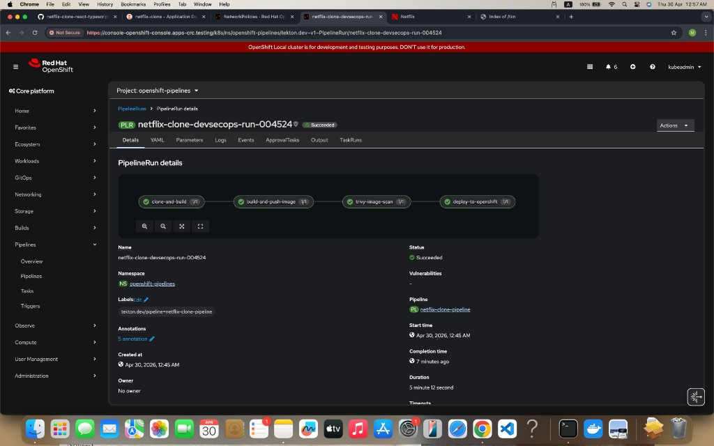
  <p align="center">Tekton PipelineRun (clone → build/push → scan → deploy)</p>

  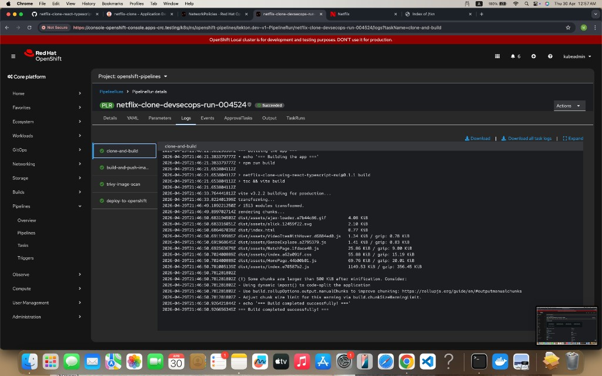
  <p align="center">Tekton task logs: clone-and-build</p>

  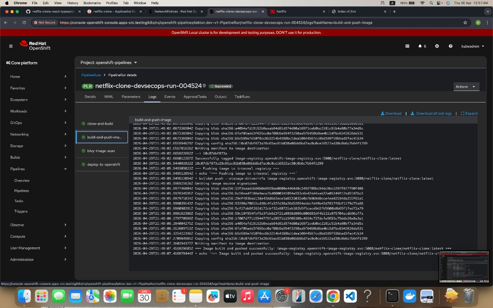
  <p align="center">Tekton task logs: build-and-push-image</p>

  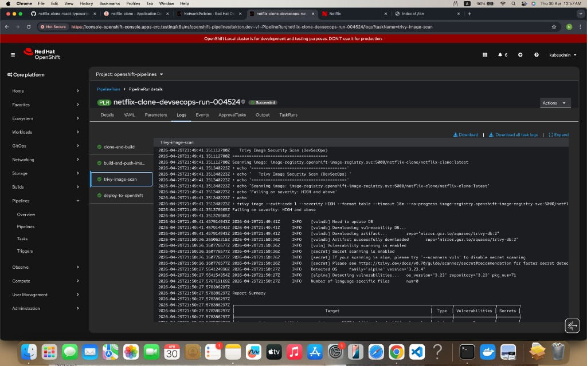
  <p align="center">Tekton task logs: trivy-image-scan</p>

  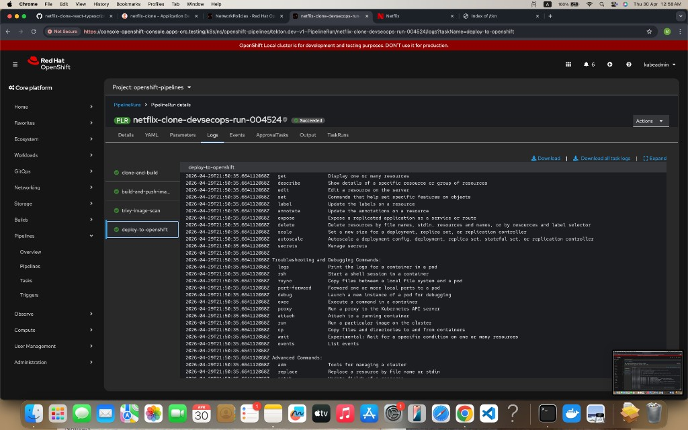
  <p align="center">Tekton task logs: deploy-to-openshift</p>

  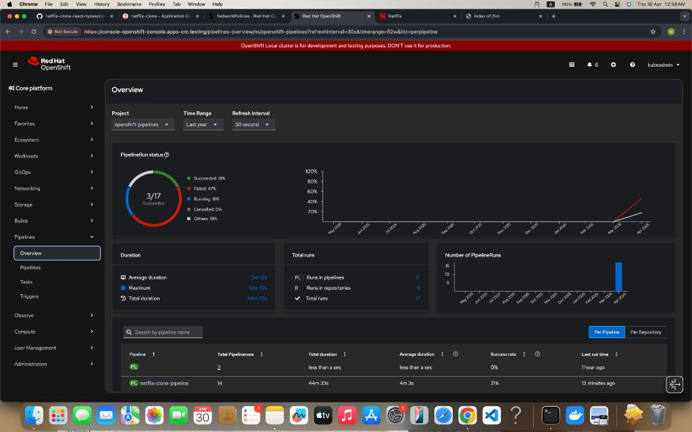
  <p align="center">Pipelines overview</p>

  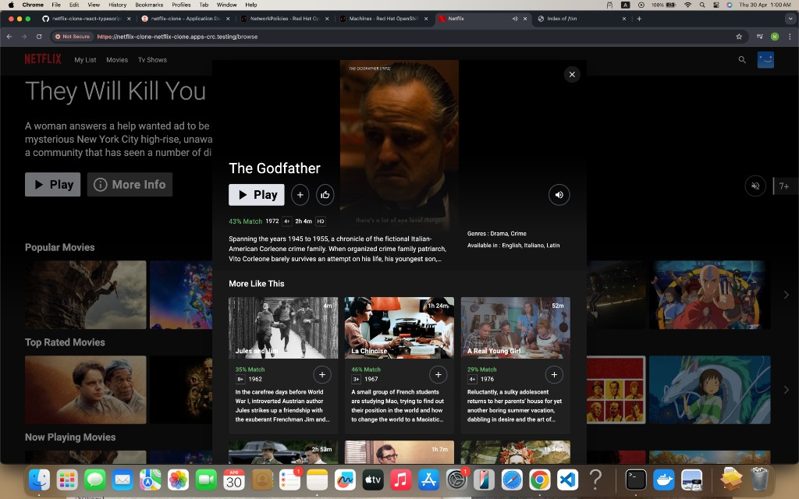
  <p align="center">Deployed app (UI)</p>
</div>

## Local development (optional)

### TMDB API key

- Create an account on [TMDB](https://www.themoviedb.org/)
- Create an API key following the [TMDB docs](https://developers.themoviedb.org/3/getting-started/introduction)
- Create `.env` based on `.env.example` and set `TMDB_V3_API_KEY`

### Run locally

```bash
npm ci
npm run dev
```

## Build & run with Docker (optional)

```bash
docker build --build-arg TMDB_V3_API_KEY=your_api_key_here -t netflix-clone .
docker run --name netflix-clone-website --rm -d -p 8080:8080 netflix-clone
```
