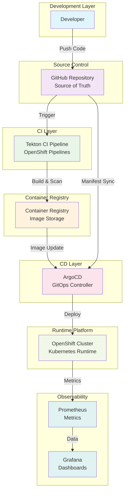

---

<div align="center">
  
  <h2>Netflix Clone - DevSecOps on OpenShift via GitOps</h2>
  <p>
    React + TypeScript + Vite application deployed on <b>OpenShift</b> using <b>ArgoCD GitOps</b>.
  </p>
</div>

---

# Architecture Diagram



---

# What's in this Repo

### Application Services
- **Frontend**: React + TypeScript + Vite (`src/`)
- **Kubernetes Manifests**: OpenShift-specific configurations (`openshift/`)
- **GitOps Configuration**: ArgoCD Application definition (`argocd/`)

### DevSecOps & GitOps Features
- **GitOps** continuous delivery using ArgoCD
- **Security Scanning** with Trivy integrated in Tekton
- **Kubernetes-native** deployment with best practices
- **Resource Governance**: ResourceQuota, LimitRange, HPA, PDB
- **Security Controls**: SecurityContext, ServiceAccount, RoleBinding

## Repository Structure
```text
.
├─ argocd/
│   └─ application.yaml          # ArgoCD Application
├─ openshift/                    # Desired State (GitOps)
│   ├─ kustomization.yaml
│   ├─ namespace.yaml
│   ├─ security.yaml
│   ├─ deployment.yaml
│   ├─ service.yaml
│   ├─ route.yaml
│   ├─ hpa.yaml
│   ├─ pdb.yaml
│   ├─ resource-quota.yaml
│   └─ limit-range.yaml
└─ src/                          # React + TypeScript Application
```

---

# GitOps Delivery with Argo CD

The file `argocd/application.yaml` defines an Argo CD Application named `netflix-clone` that:

- Syncs Kubernetes manifests from the `openshift/` directory
- Deploys into the target namespace
- Enables **automated sync** with:
  - `prune: true` — removes resources deleted from Git
  - `selfHeal: true` — automatically fixes configuration drift

---

# Kubernetes Deployment

The manifests in `openshift/` include:

- **Deployment** with replica management
- **Service** for internal communication
- **Route** for external access (OpenShift Router)
- **HorizontalPodAutoscaler (HPA)**
- **PodDisruptionBudget (PDB)**
- **ResourceQuota** and **LimitRange**
- **Security configurations** (ServiceAccount + SCC)

### Quick Deploy (GitOps)
```bash
oc apply -f argocd/application.yaml
```

---

# Run Locally

### Development
```bash
npm ci
npm run dev
```

### Docker
```bash
docker build --build-arg TMDB_V3_API_KEY=your_key -t netflix-clone .
docker run -p 8080:8080 netflix-clone
```

---

# Tooling Screenshots

### Application UI

**Home Page**  


**Mini Portal**  


**Detail Modal**  


**Genre Grid**  


**Watch Page**  


### OpenShift & GitOps

**Installed Operators**  


**ArgoCD Application Details**  


**ArgoCD Application Tree**  


**OpenShift Project Overview**  


**Tekton PipelineRun Details**  


**Trivy Security Scan**  


**Deployed Application**  


---

# Security Note (Important)

This project demonstrates DevSecOps practices including:

- **Trivy** vulnerability scanning in the CI pipeline
- **Non-root** containers with dropped capabilities
- **RBAC** with least privilege
- Resource isolation and governance

**For production use, ensure**:
- Proper secret management (Secrets / External Secrets Operator / Vault)
- Image signing and verification
- NetworkPolicies
- Regular updates and patching

---
؟
