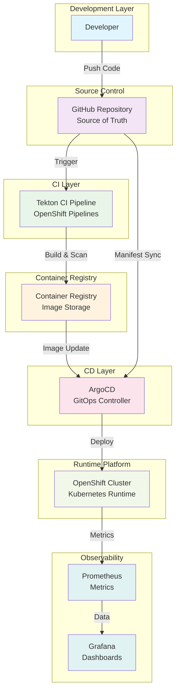

<div align="center">
  

  <h2>Netflix Clone - DevSecOps on OpenShift via GitOps</h2>

  <p>
    React + TypeScript + Vite application deployed on <b>OpenShift</b> using <b>ArgoCD GitOps</b>.
  </p>
</div>

---

# Architecture Diagram

## C4 Model: System Context



## Component Breakdown

### 1. Developer Workflow
- **Local Development**: React + TypeScript + Vite
- **Code Push**: Git commits to GitHub
- **Branch Strategy**: Feature branches → Main branch

### 2. Source Control (GitHub)
- **Application Code**: React frontend (`src/`)
- **Infrastructure as Code**: Kubernetes manifests (`openshift/`)
- **GitOps Configuration**: ArgoCD Application (`argocd/`)
- **Version Control**: Complete traceability of changes

### 3. CI Pipeline (Tekton)
```yaml
Pipeline Tasks:
  - clone-repository: Git checkout
  - build-application: npm build
  - build-image: Docker build
  - security-scan: Trivy vulnerability scan
  - push-image: Container registry push
  - update-manifest: Image tag update
```

### 4. Container Registry
- **Image Storage**: Built container images
- **Versioning**: Semantic tags and digests
- **Security**: Image signing and scanning
- **Distribution**: Pull access for clusters

### 5. CD Pipeline (ArgoCD)
```yaml
GitOps Features:
  - Continuous Sync: Git → Cluster
  - Health Monitoring: Application status
  - Drift Detection: Manual changes alert
  - Self-Healing: Automatic reconciliation
  - Rollback: Previous version restore
```

### 6. Runtime (OpenShift)
```yaml
Kubernetes Resources:
  - Deployment: Pod management
  - Service: Internal networking
  - Route: External access
  - HPA: Auto-scaling
  - PDB: Availability guarantee
  - ResourceQuota: Resource limits
  - LimitRange: Default constraints
```

### 7. Observability Stack
- **Metrics Collection**: Prometheus scraping
- **Visualization**: Grafana dashboards
- **Alerting**: Threshold-based notifications
- **Logging**: Centralized log aggregation

## Data Flow Analysis

### CI Flow
1. **Code Commit** → GitHub webhook triggers Tekton
2. **Build Process** → Creates optimized container image
3. **Security Scan** → Trivy analyzes for vulnerabilities
4. **Image Push** → Stores in container registry
5. **Manifest Update** → Updates image tag in Git

### CD Flow
1. **Git Change Detection** → ArgoCD monitors repository
2. **Sync Process** → Applies desired state to cluster
3. **Health Check** → Validates deployment success
4. **Monitoring** → Tracks application performance

## Security Considerations

### CI Security
- **Image Scanning**: Trivy vulnerability detection
- **Secret Management**: OpenShift Secrets integration
- **Access Control**: RBAC for pipeline execution
- **Audit Trail**: Complete pipeline logging

### CD Security
- **GitOps Verification**: Signed commits verification
- **Network Policies**: Restrict pod communication
- **Pod Security**: SCC and security contexts
- **Resource Isolation**: Namespace separation

## Performance Optimizations

### Build Optimization
- **Multi-stage Builds**: Reduce image size
- **Layer Caching**: Speed up builds
- **Parallel Execution**: Tekton task parallelization
- **Resource Limits**: Controlled resource usage

### Runtime Optimization
- **Horizontal Pod Autoscaler**: Scale based on demand
- **Resource Requests/Limits**: Efficient resource allocation
- **Pod Disruption Budget**: High availability
- **Health Checks**: Proactive monitoring

---

# Project Overview

This project demonstrates a **GitOps-based deployment** for a Netflix Clone application on OpenShift using ArgoCD.

## High-level system flow

GitHub → ArgoCD → OpenShift Cluster → Application Runtime

## Components

- **GitHub**
  - Source of truth for:
    - React application source code
    - Kubernetes manifests (`openshift/`)
    - ArgoCD Application definition (`argocd/`)

---

# CI/CD & Delivery Model

This project follows a **GitOps-based delivery model**.

### Delivery flow

1. Developer pushes code to GitHub
2. Git repository becomes the single source of truth
3. ArgoCD detects changes in manifests
4. OpenShift reconciles cluster state automatically
5. Application is deployed or updated

---

### Important clarification

- CI pipelines (build, scan, image push) are **NOT implemented in this repository as code**
- If CI is used, it is handled at **cluster level (OpenShift Pipelines / Tekton)** and is outside repository scope
- This repository focuses only on **GitOps CD (Continuous Delivery)**

---

## DevSecOps Features

- Kubernetes-native deployment:
  - Deployment
  - Service
  - Route

- GitOps (ArgoCD):
  - Automated sync
  - Self-healing
  - Drift correction

- Scaling:
  - HorizontalPodAutoscaler (CPU-based)

- Resilience:
  - PodDisruptionBudget

- Resource Governance:
  - ResourceQuota
  - LimitRange

- Security Controls:
  - ServiceAccount
  - RoleBinding (OpenShift SCC integration)

---

## What is in this repo

This repository contains only **application-owned artifacts**:

- React + TypeScript source code (`src/`)
- Kubernetes manifests (`openshift/`)
- ArgoCD Application definition (`argocd/application.yaml`)

---

## What is NOT in this repo

The following components are **external / cluster-managed** and NOT stored in this repository:

- ArgoCD Operator installation
- OpenShift cluster infrastructure
- Monitoring stack (Prometheus / Grafana)
- Image registry (Quay / DockerHub)
- Ingress / Router infrastructure
- CI pipelines (Tekton / OpenShift Pipelines)

---

## Repository Structure

```text
.
├─ argocd/
│  └─ application.yaml        # ArgoCD Application definition
├─ openshift/                # Desired cluster state (GitOps managed)
│  ├─ kustomization.yaml
│  ├─ namespace.yaml
│  ├─ security.yaml
│  ├─ deployment.yaml
│  ├─ service.yaml
│  ├─ route.yaml
│  ├─ hpa.yaml
│  ├─ pdb.yaml
│  ├─ resource-quota.yaml
│  └─ limit-range.yaml
└─ src/                      # React application
```

## Deploy on OpenShift (GitOps)

### Prerequisites

- **OpenShift cluster** (CRC / dev cluster is fine)
- **OpenShift GitOps (ArgoCD)** installed (usually via Operator)
- **Access** to create an ArgoCD `Application` in `openshift-gitops`

### Steps

1. **Push this repository** to your GitHub (or any git server ArgoCD can reach).
2. **Update the repo URL** in `argocd/application.yaml`:
   - `spec.source.repoURL`: point to your fork/repo
   - `spec.source.targetRevision`: branch (e.g. `main`)
3. **Apply the ArgoCD Application** (example):

```bash
oc apply -f argocd/application.yaml
```

4. Open ArgoCD UI and confirm the app becomes **Synced** and **Healthy**.
5. The app is exposed via **OpenShift Route** (`openshift/route.yaml`).

# Screenshots

## Application UI

### Home Page
<div align="center">
  
</div>

**Home Page** - Main user interface of the Netflix Clone application displaying:
- List of popular movies and TV shows
- Modern design similar to Netflix
- Smooth user interaction
- Dynamic content display from TMDB API

---

### Mini Portal
<div align="center">
  
</div>

**Mini Portal** - Dedicated interface for displaying:
- Curated and categorized content
- Quick access to different sections
- Responsive design working on all devices
- Enhanced user experience for quick browsing

---

### Detail View
<div align="center">
  
</div>

**Detail View** - Modal window displaying:
- Complete information about movie or TV show
- Rating, date, and duration
- Cast and director list
- Story description and official poster
- Option to add to watchlist

---

### Genre Grid
<div align="center">
  
</div>

**Genre Grid** - Content classification page:
- Display all movies by genre (Action, Comedy, Drama, etc.)
- Organized grid design for easy searching
- Advanced filtering by year and rating
- Dynamic content loading on scroll

---

### Watch Page
<div align="center">
  
</div>

**Watch Page** - Content playback interface:
- Integrated video player
- Movie information during playback
- Playback quality control
- Auto-play queue
- Subtitle and audio options

## OpenShift & GitOps

> These screenshots were captured from OpenShift + ArgoCD UI to document the real platform workflow.

### Installed Operators
<div align="center">
  
</div>

**Installed Operators** - Display of installed operators in OpenShift:
- **OpenShift GitOps**: ArgoCD operator for continuous deployment (GitOps)
- **OpenShift Pipelines**: Tekton operator for continuous integration (CI)
- Ensure operators are installed in ready and stable state

---

### ArgoCD Application Details
<div align="center">
  
</div>

**ArgoCD Application Details** - Comprehensive application information:
- Sync Status: Synced
- Health Status: Healthy
- Source information: GitHub repository URL
- Target: OpenShift cluster namespace
- Last sync timestamp and configuration details

---

### ArgoCD Application Tree
<div align="center">
  
</div>

**ArgoCD Application Tree** - Hierarchical resource view:
- **Deployment**: Application replica management
- **Service**: Internal cluster routing
- **Route**: External access via URL
- **HPA**: Horizontal auto-scaling
- **PDB**: Pod disruption budget
- **ResourceQuota**: Resource quotas
- **LimitRange**: Resource limits

---

### OpenShift PipelineRun Logs
<div align="center">
  
</div>

**OpenShift PipelineRun Logs** - Detailed execution logs from the `netflix-clone-devsecops-run-004524` PipelineRun:
- **PipelineRun Status**: Succeeded
- **Task Focus**: `trivy-image-scan` task logs displayed
- **Security Scan Execution**:
  - Trivy Image Security Scan (DevSecOps) initiated
  - Target image: `image-registry.openshift-image-registry.svc:5000/netflix-clone/netflix-clone:latest`
  - Severity threshold: HIGH and above
- **Database Operations**:
  - Vulnerability database update completed
  - Artifacts downloaded successfully
- **Scanning Configuration**:
  - Vulnerability scanning enabled
  - Secret scanning enabled
- **OS Detection**: Alpine Linux version 3.23.4 identified
- **File Analysis**: 8 language-specific files detected for vulnerability scanning
- **Pipeline Integration**: Security scanning seamlessly integrated into CI/CD workflow

---

### OpenShift Project Overview
<div align="center">
  
</div>

**OpenShift Project Overview** - Project control panel:
- Pod status and distribution
- Resource usage (CPU/Memory/Storage)
- Network and Routes information
- Events and alerts list
- Applications and services statistics

---

### Pod Metrics
<div align="center">
  
</div>

**Pod Metrics** - Performance monitoring of pods:
- **CPU Usage**: Real-time processor usage
- **Memory Usage**: Memory usage and distribution
- **Network I/O**: Data transfer over network
- **Storage I/O**: Read and write operations
- Interactive performance graphs

---

### Tekton PipelineRun Details
<div align="center">
  
</div>

**Tekton PipelineRun Details** - CI workflow:
- **clone-and-build**: Repository clone and application build
- **build-and-push-image**: Container image build and push
- **trivy-image-scan**: Security scan with Trivy
- **deploy-to-openshift**: Deployment to OpenShift
- Execution duration and task status

---

### Tekton Clone and Build
<div align="center">
  
</div>

**Tekton Clone and Build Logs** - First task details:
- Pull source code from GitHub
- Install dependencies (npm ci)
- Build application (npm run build)
- Code quality and tests verification
- Environment variables setup

---

### Tekton Build and Push Image Logs
<div align="center">
  
</div>

**Tekton Build and Push Image Logs** - Detailed container image creation and registry operations:
- **Build Process**:
  - Multi-stage Docker build execution
  - Optimized layer caching for faster builds
  - Security context application during build
- **Image Creation**:
  - Application containerization
  - Dependency layer optimization
  - Runtime environment preparation
- **Registry Operations**:
  - Image push to OpenShift internal registry
  - Tag management and versioning
  - Authentication and authorization
- **Build Configuration**:
  - Build context and Dockerfile processing
  - Build arguments and environment variables
  - Target platform specification
- **Security Integration**:
  - Build-time security scanning preparation
  - Image signing and integrity verification
  - Compliance with container security policies
- **Performance Metrics**:
  - Build duration and resource usage
  - Image size optimization results
  - Registry transfer statistics

---

---

### Tekton Trivy Security Scan
<div align="center">
  
</div>

**Tekton Trivy Security Scan Logs** - Vulnerability scanning:
- Scan container image for vulnerabilities
- Detailed security risk report
- Vulnerability classification (Critical/High/Medium/Low)
- Remediation and update recommendations
- Security policy integration

---

### Tekton Deploy to OpenShift
<div align="center">
  
</div>

**Tekton Deploy to OpenShift Logs** - Actual deployment:
- Update Kubernetes manifests
- Apply changes to OpenShift
- Wait for new pods readiness
- Verify services and Routes health
- Complete deployment successfully

---

### Tekton Pipelines Overview
<div align="center">
  
</div>

**Tekton Pipelines Overview** - Control panel:
- List of defined pipelines
- Previous runs status
- Success and failure statistics
- Execution times and comparisons
- Failed runs retry capability

---

### Deployed Application UI
<div align="center">
  
</div>

**Deployed Application UI** - Final result:
- Application running on OpenShift
- Access via OpenShift Route
- Application functionality verification
- Performance and responsiveness in production
- External services integration

---

### OpenShift Project Details

<div align="center">
  
</div>

**Project Overview** - Complete OpenShift project information:
- **Project Name**: netflix-clone
- **Status**: Active
- **Labels**: Kubernetes metadata and OpenShift Pipelines configuration
- **Inventory**: 1 Deployment, 1 Pod running
- **Resource Utilization**: Real-time CPU, Memory, and Network metrics

**Utilization Metrics** (Last Hour):
- **CPU**: 0.116m used (out of 200m limit)
- **Memory**: 7.84 MiB used (out of 200 MiB limit)
- **Filesystem**: 260 KiB used (out of 200 KiB limit)
- **Network**: 98.13 Bps in, 312.8 Bps out
- **Pod Count**: 1 active pod

**Activity Timeline** - Recent events:
- Image pulls and container creation
- Pod lifecycle events (start/stop/delete)
- Network interface configuration
- Automatic scaling and restart events

---

### ArgoCD Application Management

<div align="center">
  
</div>

**Application Status** - Real-time ArgoCD information:
- **Health Status**: Healthy
- **Sync Status**: Synced to main (bf0793e)
- **Auto-sync**: Enabled
- **Last Sync**: Sync OK to a844d31 (17 hours ago)
- **Author**: Mina George Razk

**Application Tree** - Hierarchical resource view:
- **netflix-clone**: Main application deployment
- **netflix-clone-hpa**: Horizontal Pod Autoscaler
- **netflix-clone-pdb**: Pod Disruption Budget
- **Replica Sets**: Multiple replica sets for rolling updates
- **Pods**: Individual pod instances with health status

**Sync Statistics**:
- **Synced Items**: 4 resources synchronized
- **Out of Sync**: 0 resources
- **Healthy Resources**: 16 healthy components
- **Failed Resources**: 0 failures

**Recent Commit Activity**:
- "fix: update kustomization.yaml for Argo CD compatibility (remove namespace.yaml)"
- Author: MinaC4
- Timestamp: 20 hours ago
- Auto-sync applied successfully

---

### OpenShift Pod Metrics

<div align="center">
  
</div>

**Pod Metrics Overview** - Real-time resource utilization for `netflix-clone-654c78cfd9-sg2ff`:
- **Memory Usage**: Current usage against allocated limits (e.g., 500 MiB)
- **CPU Usage**: Current CPU consumption in millicores (e.g., 200m)
- **Filesystem**: Disk I/O and storage usage (e.g., 200 KiB)
- **Network In**: Incoming network traffic in Bps

**Key Observations**:
- Consistent resource usage patterns over time
- Metrics indicate stable performance within allocated limits
- No significant spikes or anomalies observed
- Development cluster warning displayed (not for production use)

---

### OpenShift PipelineRun Details

<div align="center">
  
</div>

**PipelineRun Details** - Comprehensive view of the CI/CD pipeline execution:
- **PipelineRun Name**: `netflix-clone-devsecops-run-004524`
- **Status**: Succeeded
- **Namespace**: `openshift-pipelines`
- **Pipeline**: `netflix-clone-pipeline`
- **Start Time**: Apr 30, 2026, 12:45 AM
- **Completion Time**: 7 minutes ago
- **Duration**: 5 minutes 12 seconds

**Pipeline Tasks Overview**:
- **clone-and-build**: Successfully cloned the repository and built the application
- **build-and-push-image**: Successfully built and pushed the Docker image to the registry
- **trivy-image-scan**: Successfully scanned the image for vulnerabilities using Trivy
- **deploy-to-openshift**: Successfully deployed the application to OpenShift

---

### OpenShift PipelineRun Logs

<div align="center">
  
</div>

**PipelineRun Logs** - Detailed execution logs for the `clone-and-build` task:
- **Build Process**: 
  - npm run build execution
  - TypeScript compilation with Vite
  - Asset generation and optimization
- **Output Artifacts**:
  - JavaScript and CSS bundles generated
  - Asset sizes reported (e.g., index-abc123.js 45.2KB)
  - Source maps and chunk splitting
- **Build Warnings**:
  - Large chunk size warnings after minification
  - Recommendations for dynamic imports or chunk size limit adjustments
- **Final Status**: "Build completed successfully!"

